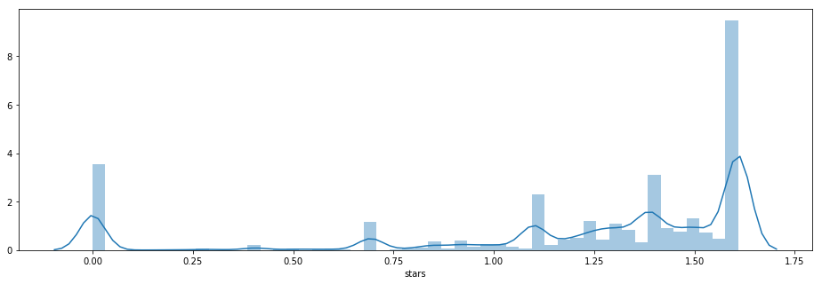
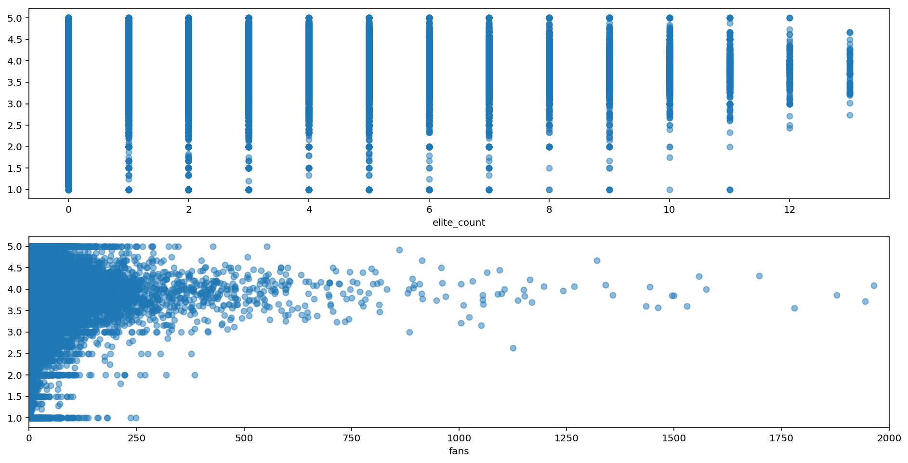
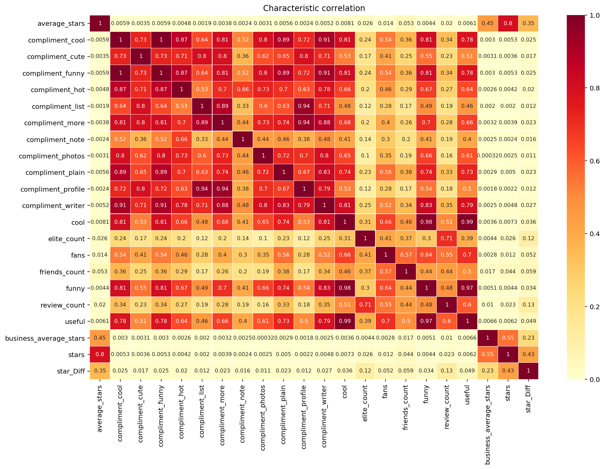

```python
import pandas as pd
import numpy as np
import pickle
import matplotlib
import matplotlib.pyplot as plt
from scipy import stats
import seaborn as sns
from pylab import rcParams
```


```python
data = pd.read_csv("/Users/cestdrama/Desktop/yelp_feature.csv")
```

##### dataset shape


```python
data.shape
```


    (1048575, 22)


###### Sample of our dataset


```python
data.head()
```


<div>
<style scoped>
    .dataframe tbody tr th:only-of-type {
        vertical-align: middle;
    }

    .dataframe tbody tr th {
        vertical-align: top;
    }

    .dataframe thead th {
        text-align: right;
    }
</style>
<table border="1" class="dataframe">
  <thead>
    <tr style="text-align: right;">
      <th></th>
      <th>average_stars</th>
      <th>compliment_cool</th>
      <th>compliment_cute</th>
      <th>compliment_funny</th>
      <th>compliment_hot</th>
      <th>compliment_list</th>
      <th>compliment_more</th>
      <th>compliment_note</th>
      <th>compliment_photos</th>
      <th>compliment_plain</th>
      <th>...</th>
      <th>cool</th>
      <th>elite_count</th>
      <th>fans</th>
      <th>friends_count</th>
      <th>funny</th>
      <th>review_count</th>
      <th>useful</th>
      <th>business_average_stars</th>
      <th>stars</th>
      <th>star_Diff</th>
    </tr>
  </thead>
  <tbody>
    <tr>
      <th>0</th>
      <td>4.03</td>
      <td>1</td>
      <td>0</td>
      <td>1</td>
      <td>2</td>
      <td>0</td>
      <td>0</td>
      <td>1</td>
      <td>0</td>
      <td>1</td>
      <td>...</td>
      <td>25</td>
      <td>3</td>
      <td>5</td>
      <td>99</td>
      <td>17</td>
      <td>95</td>
      <td>84</td>
      <td>3.857143</td>
      <td>4.000000</td>
      <td>0.142857</td>
    </tr>
    <tr>
      <th>1</th>
      <td>3.63</td>
      <td>1</td>
      <td>0</td>
      <td>1</td>
      <td>1</td>
      <td>0</td>
      <td>0</td>
      <td>0</td>
      <td>0</td>
      <td>0</td>
      <td>...</td>
      <td>16</td>
      <td>0</td>
      <td>4</td>
      <td>1152</td>
      <td>22</td>
      <td>33</td>
      <td>48</td>
      <td>3.976190</td>
      <td>3.666667</td>
      <td>0.309524</td>
    </tr>
    <tr>
      <th>2</th>
      <td>3.71</td>
      <td>0</td>
      <td>0</td>
      <td>0</td>
      <td>0</td>
      <td>0</td>
      <td>0</td>
      <td>1</td>
      <td>0</td>
      <td>0</td>
      <td>...</td>
      <td>10</td>
      <td>0</td>
      <td>0</td>
      <td>15</td>
      <td>8</td>
      <td>16</td>
      <td>28</td>
      <td>3.794118</td>
      <td>3.705882</td>
      <td>0.088235</td>
    </tr>
    <tr>
      <th>3</th>
      <td>4.85</td>
      <td>0</td>
      <td>0</td>
      <td>0</td>
      <td>1</td>
      <td>0</td>
      <td>0</td>
      <td>0</td>
      <td>0</td>
      <td>2</td>
      <td>...</td>
      <td>14</td>
      <td>0</td>
      <td>5</td>
      <td>525</td>
      <td>4</td>
      <td>17</td>
      <td>30</td>
      <td>4.000000</td>
      <td>5.000000</td>
      <td>1.000000</td>
    </tr>
    <tr>
      <th>4</th>
      <td>4.08</td>
      <td>80</td>
      <td>0</td>
      <td>80</td>
      <td>28</td>
      <td>1</td>
      <td>1</td>
      <td>16</td>
      <td>5</td>
      <td>57</td>
      <td>...</td>
      <td>665</td>
      <td>4</td>
      <td>39</td>
      <td>231</td>
      <td>279</td>
      <td>361</td>
      <td>1114</td>
      <td>4.076923</td>
      <td>4.692308</td>
      <td>0.615385</td>
    </tr>
  </tbody>
</table>
<p>5 rows × 22 columns</p>
</div>


##### check if there any null value in the dataset


```python
data.isnull().values.any()
```


    False


##### data describe


```python
data.stars.describe()
```


    count    1.048575e+06
    mean     3.678650e+00
    std      1.320701e+00
    min      1.000000e+00
    25%      3.000000e+00
    50%      4.000000e+00
    75%      5.000000e+00
    max      5.000000e+00
    Name: stars, dtype: float64


##### Histogram of our dataset


```python
target = np.log(data.stars)
plt.figure(figsize = (16,5))
sns.distplot(target)
```


    <matplotlib.axes._subplots.AxesSubplot at 0x11f6d5908>





##### features observing


```python

%config InlineBackend.figure_format = 'retina'
#size 
plt.figure(figsize=(16, 8))
#draw
plt.subplot(2, 1, 1)
plt.xlabel('elite_count')
plt.scatter(data['elite_count'], data['stars'], alpha=0.5)
plt.subplot(2, 1, 2)
plt.xlim(0,2000)
plt.xlabel('fans')
plt.scatter(data['fans'], data['stars'], alpha=0.5)
plt.show()
```





#### Correlation  matrix  and Heapmap


```python
header=data.columns.values.tolist()
print(header)
print(len(header))
```

    ['average_stars', 'compliment_cool', 'compliment_cute', 'compliment_funny', 'compliment_hot', 'compliment_list', 'compliment_more', 'compliment_note', 'compliment_photos', 'compliment_plain', 'compliment_profile', 'compliment_writer', 'cool', 'elite_count', 'fans', 'friends_count', 'funny', 'review_count', 'useful', 'business_average_stars', 'stars', 'star_Diff']
    22


```python
matplotlib.use('TkAgg')

correlations = data.corr() 
correction=abs(correlations)

fig = plt.figure() 
ax = plt.subplots(figsize=(15, 10))
ax = sns.heatmap(correction,cmap='YlOrRd', linewidths=0.05,vmax=1, vmin=0 ,annot=True,annot_kws={'size':8})
plt.xticks(np.arange(22)+0.5,header) 
plt.yticks(np.arange(22)+0.5,header) 
ax.set_title('Characteristic correlation')
plt.savefig('cluster.png',dpi=300)
plt.figure(figsize=(50,20))
plt.show()
```


    <Figure size 432x288 with 0 Axes>





    <Figure size 3600x1440 with 0 Axes>


##### correction to stars


```python
print(correction["stars"].sort_values(ascending=True))
```

    compliment_list           0.002005
    compliment_profile        0.002208
    compliment_note           0.002406
    compliment_photos         0.002518
    compliment_cute           0.003551
    compliment_more           0.003893
    compliment_hot            0.004202
    funny                     0.004449
    compliment_writer         0.004830
    compliment_plain          0.005035
    compliment_cool           0.005336
    compliment_funny          0.005336
    useful                    0.006222
    cool                      0.007256
    fans                      0.012243
    review_count              0.022514
    elite_count               0.025770
    friends_count             0.043602
    star_Diff                 0.430907
    business_average_stars    0.553270
    average_stars             0.803174
    stars                     1.000000
    Name: stars, dtype: float64


```python

```
